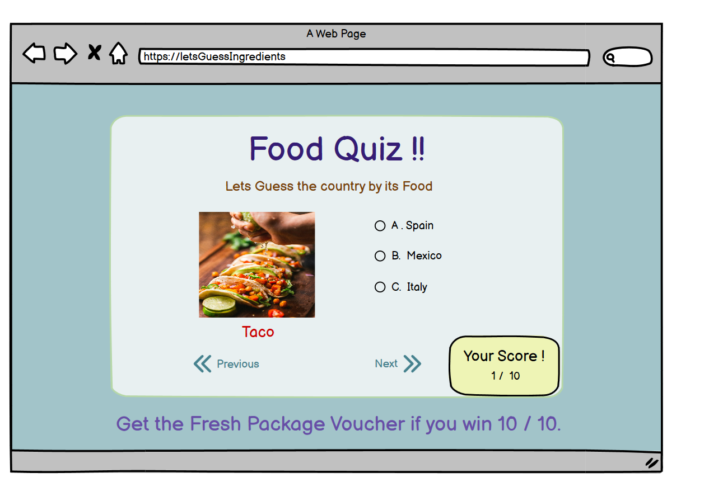
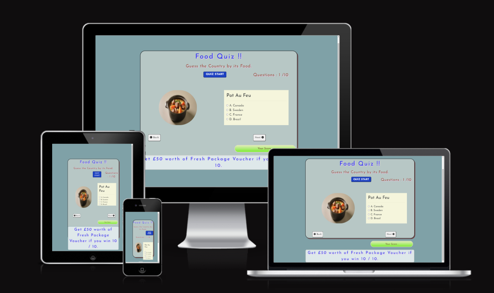
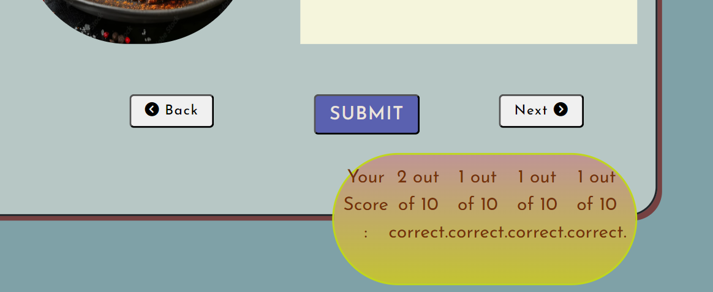
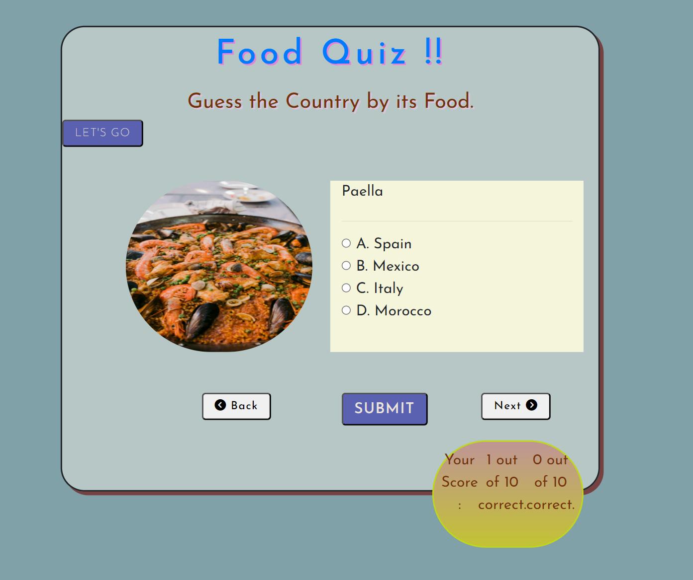
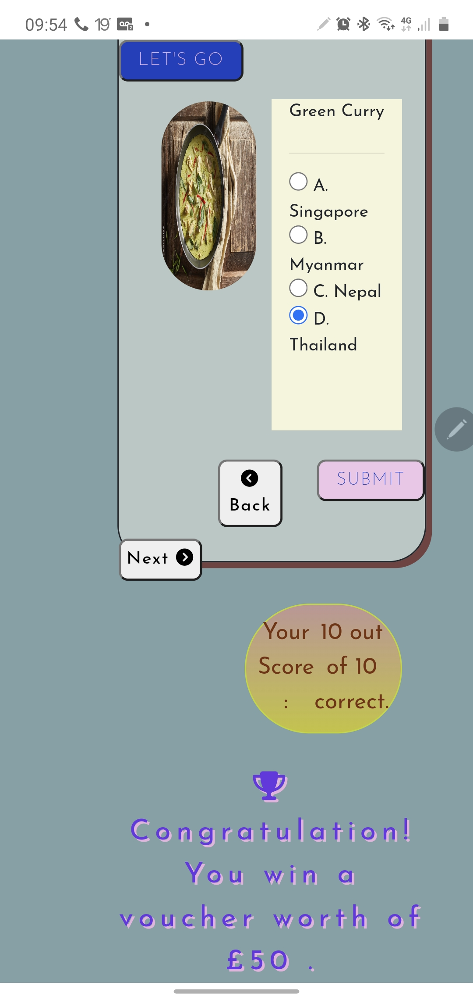
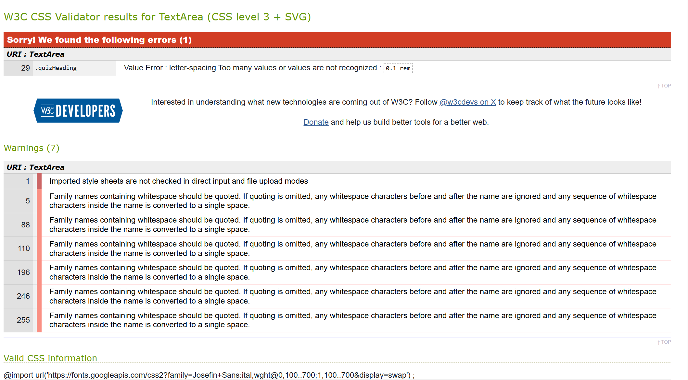
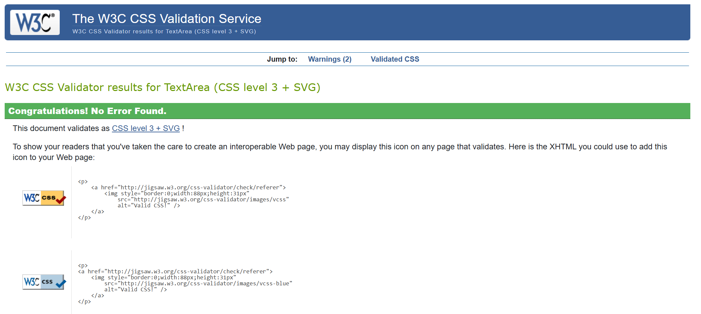
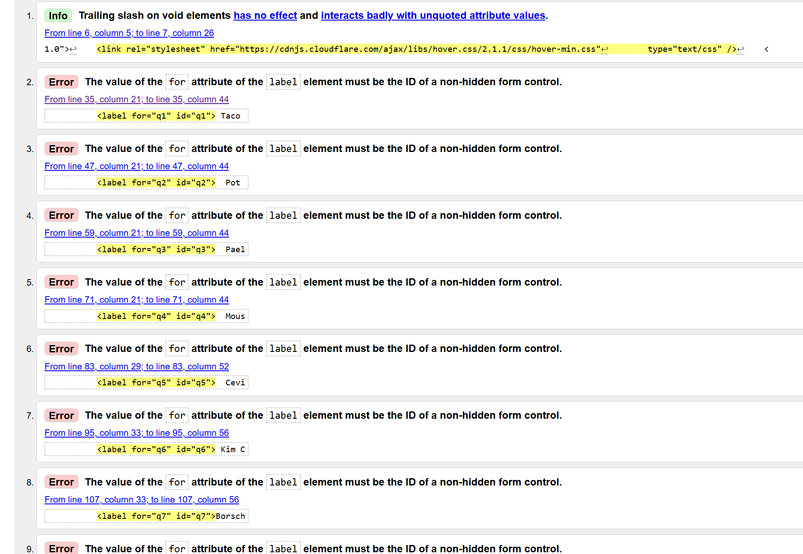
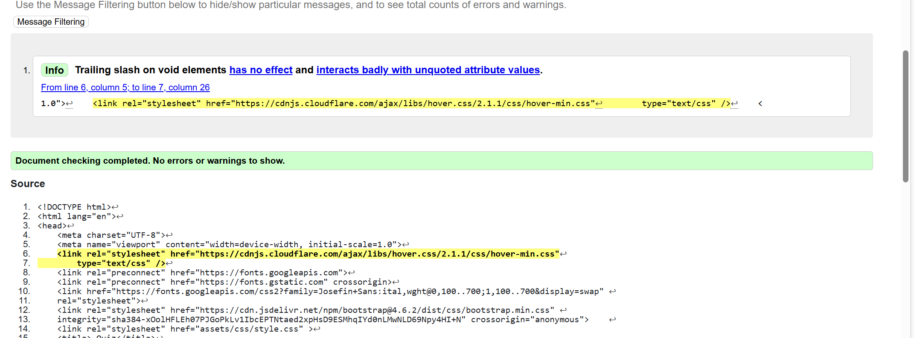
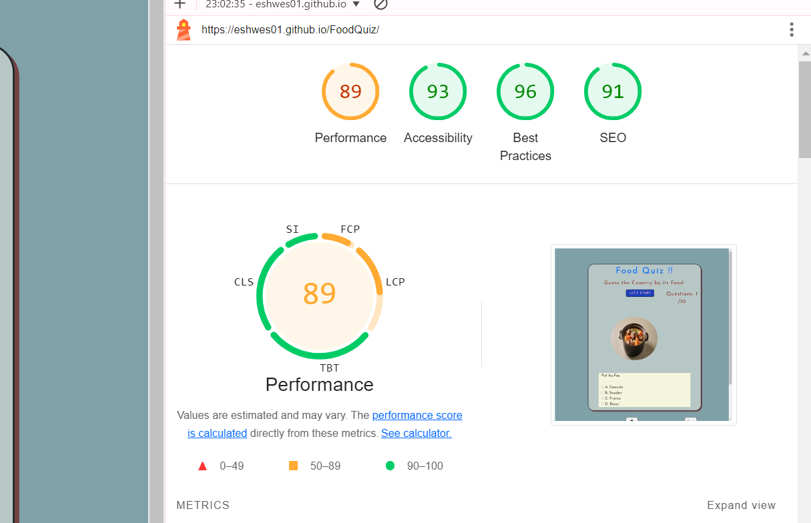

# TABLE OF CONTENTS

# Features
 1. Call to Action: The **"QUIZ START"** action button has used.
 2. User can see the **current question** number on the right hand corner of the quiz area.

 3. BACK and NEXT navigation buttons are accessable underneath each questions. 

 4. Reward Notification area is designed to be updated whether user answered all questions correctly or not.

## Responsive design

Media query for both medium and small devices has applied in CSS . While developing developer found that there still need to make some improvements in layout of the mobile devices in the future.

# UX/UI

 Single page quiz page with interactive features.  

## 1. Target Audience

  This **Food Quiz** website is aiming for the people who loves both food and quiz. As part of the marketing strategy this quiz can enhance user to visit the page frequently in order to receive the reward. 

## 2. USER STORIES
1. As a **User** I can be able find the Start button for starting the quiz **
2. As a **User** I can be Able to Submit for my choices and can see the update score once hit submit **
3. As a **User** I can be able to see and check my answer by using previous and next buttons of the quiz **
4. As a **User** I should be notified by the question that I missed when submit the quiz **
5. As a **User** I can be Able see the result showing correct answer count when hit submit **
6. As a **Site Owner** I should notify that user win voucher as promised if they got all correct answers **
7. As a **developer** I should notify that user didn't answer all questions correctly and do not win voucher **

My Project Board link here https://github.com/users/eshwes01/projects/2

## 3. Design choice
  
  Easy, simple and clean ,user oriented design was created as well as the use of easy navigable buttons. High quality food images has been used for all questions to be visually appealling to the users of all ages.
  

## 4. Colour Scheme
  Light colour scheme and cool tone has applied throughout the page. Text shadow mainly is for 

## 5. Typography / Fonts

  Google font **"Josefin Sans"** has used as developer thought it matches with the themes of the quiz attract user attention.
  Use consistent fonts across the whole design.
 
 ## 4. Wireframes
    
  -	

  ## Am I Responsive
   

## 5. Testing & Known Bugs
  
### Functional Testing

1. Submit button doesn't work correctly earlier in the stage of development and it didn't clear the session when refresh

### Responsive Testing
This screenshot has seen when testing with Mobile device.

Another testing from Samsung Note 10 and has fixed it .

## 6. HTML , CSS and JS Validation
  Warning messages 
  

  Pased CSS code validation below, 
   
  
  HTML code validation with warning below 
   
  
  Passed HTML code after fixed 

  
## 6. Lighthouse Check

Passed HTML code after fixed 

## 7. Credits

Quiz idea has inspired from the Guess Game program called "Guessr" from Youtube.com https://www.youtube.com/watch?v=OuKo5MVaeWU 

Food Images are taken from these links below, 
https://unsplash.com/photos/cooked-tacos-lP5MCM6nZ5A?utm_content=creditShareLink&utm_medium=referral&utm_source=unsplash

https://stock.adobe.com/uk/images/id/508750819?clickref=1011lzyAkogC&mv=affiliate&mv2=pz&as_camptype=&as_channel=affiliate&as_source=partnerize&as_campaign=wbm

https://stock.adobe.com/uk/

https://unsplash.com/photos/vegetable-salad-on-white-plate-on-brown-table-YmC1_EP6TJQ?utm_content=creditShareLink&utm_medium=referral&utm_source=unsplash

## 8. Future Features

 ### 1.   "Notification If Any Unanswered Question", this feature has missed out as of time limit better to add in the next sprint.
 ### 2.   User should only see the Quiz Start button at the start of the page. First question would appear only when user click start .

 ### 3. Few known bugs to fix in the next sprint

      a)  Quiz Start Button should perform as reset button however session doesn't clear fully and user can still see the saved answers.This should be fix as it can confuse to the user.

      b)  Mobile size device responsive layout needed to be fixed as it has to be more compact and reducing space to attract user with more important element.  