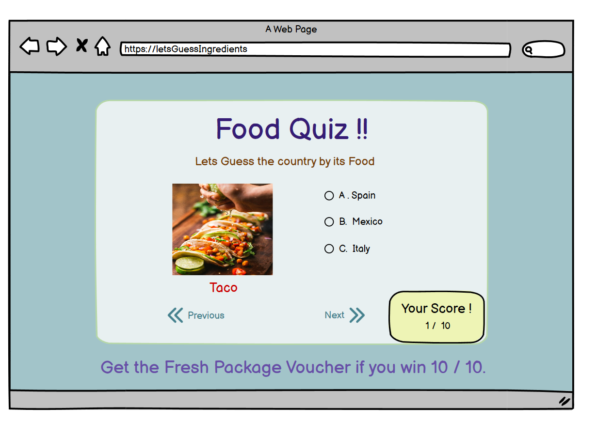

# TABLE OF CONTENTS

 - 

# Features

## Responsive design

# UX/UI

## 1. Target Audience

## 1. USER STORIES
1. As a **User** I can be able find the Start button for starting the quiz **
2. As a **User** I can be Able to Submit for my choices and can see the update score once hit submit **
3. As a **User** I can be able to see and check my answer by using previous and next buttons of the quiz **
4. As a **User** I should be notified by the question that I missed when submit the quiz **
5. As a **User** I can be Able see the result showing correct answer count when hit submit **
6. As a **Site Owner** I should notify that user win voucher as promised if they got all correct answers **
7. As a **developer** I should notify that user didn't answer all questions correctly and do not win voucher **

## 3. Design choice

## Colour Scheme

## Fonts

 
 ## 4. Wireframes
    
<<<<<<< HEAD
  -	
=======
  -
>>>>>>> refs/remotes/origin/main

  ## Am I Responsive
   

## 5. Testing

### Functional Testing

### Known Bugs

